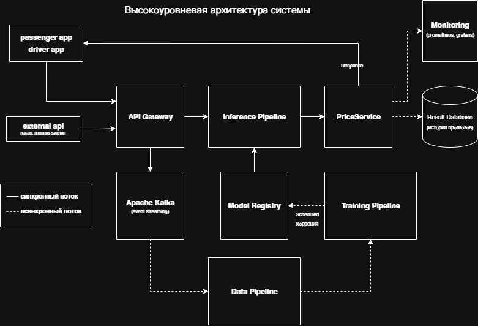
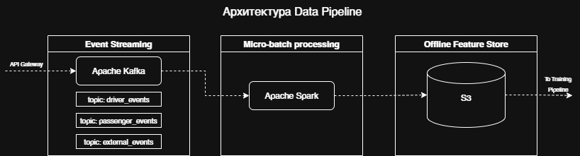
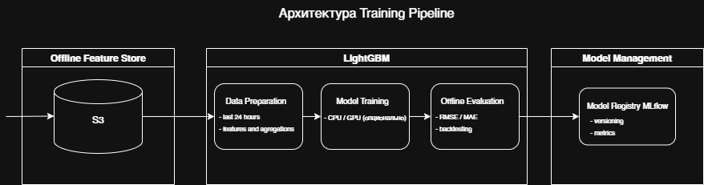
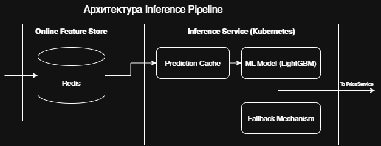

# Вариант 13. Динамическое ценообразование для райдшеринга.

**Курс:** Проектирование систем машинного обучения

**Уровень:** 2 курс магистратуры

**Студент:** Савва Даниил

**Группа:** М80-214СВ-24

## Введение и постановка задачи

Спроектировать систему для прогнозирования спроса и предложения для установки пиковых цен для райдшеринга. Сделать акцент на прогнозировании временных рядов и обновлениях в реальном времени.

**Бизнес-цели:**

* Снижение операционных затрат: уменьшение времени простоя водителей и объёма субсидий на 10% за счёт динамической балансировки спроса и предложения,
* Увеличение вовлеченности пользователей: увеличить долю обслуженных запросов на 10% за счет динамической балансировки спроса и предложения.

**Требования к системе:**

* **Задержка (latency)** ответа системы не должна превышать 177 мс.
* **Система должна обслуживать** 2,432,132 активных пользователей в день (DAU)
* **Пропускная способность** с пиковой нагрузкой (throughput): 10,670 запросов в секунду (RPS).
* **Масштабируемоость:** Система должна выдерживать рост нагрузки в 3 раза.
* **Отказоустойчивость:** Система должна быть не менее 99.9%.

## Часть 1: Формулировка ML-задачи и выбор модели.

### 1.1. Определение ML-задачи.

### 1.1.1 Как можно сформулировать задачу?

Основная задача формулируется как прогнозирование временных рядов (регрессия) в реальном времени (что также указано и в условии задания):

* прогноз спроса (количество запросов на поездки);

* прогноз предложения (количество доступных водителей).

На основе этих прогнозов вычисляется коэффициент пикового ценообразования (surge multiplier). Дополнительно задача может рассматриваться как:

* многомерная регрессия (спрос и предложение одновременно),

* либо как прогноз дисбаланса спрос/предложение.

### 1.1.2. Какой будет таргет (целевая переменная)?

Основной целевой переменной является прогноз соотношения количества запросов пассажиров (это спрос, demand) к количеству доступных водителей (это предложение, supply) в предлелах 5 минут от точки заказа клиентом.

* соотношение спроса и предложения ratio_demand_supply = log((demand + 1) / (supply + 1)), где demand - спрос, supply - предложение. Log, чтобы в 0 ошибки не уходило в бесконечность.

### 1.1.3. Какие данные вам понадобятся для обучения?

Предлагаются следующие features:

**Поездка**

* местоположение (район, квартал, grid на карте) начала поездки клиента,
* день недели и время заказа,
* время ожидания,
* статус поездки, все ли в порядке, доехали ли (завершено/отмена),

**Водители**

* количество активных водителей в районе, квартале откуда был сделан заказ,
* статус (свободен / в поездке),
* время входа/выхода из системы.

**Внешние факторы**

* праздники,
* погодные условия,
* события (концерты, матчи — опционально).

**Агрегации**

* спрос/предложение за последние 5-15 минут,
* скользящие средние,
* ошибки (t-1, t-5, t-15 минут).

### 1.2. Выбор модели

**Вариант 1: Gradient Boosting (LightGBM / CatBoost)**.

Плюсы:
* отлично работает с табличными данными,
* быстрое inference-время (по условию допустимая задержка 177 мс),
* хорошо учитывает нелинейности.

Минусы:
* ограниченная работа с длинными временными зависимостями,
* требует ручного feature engineering.

**Вариант 2: LSTM / Temporal Convolutional Network (TCN)**.

Плюсы:
* хорошо моделирует временные зависимости,
* хорошо работает с временными рядами,
* лучше ловит сезонность и тренды.

Минусы:
* более сложная инфраструктура,
* выше latency (> 177 мс будет),
* сложнее масштабировать под высокий RPS.

**Выбранная модель: вариант 1 Gradient Boosting (LightGBM)**.

Ключевым фактором является выполнение условие задержки latency (177 мс), масштабируется горизонтально (добавление физических серверов), можно переобучать часто (каждые 15-60 минут).

## Часть 2: Проектирование архитектуры.

### 2.1 Высокоуровневая архитектура системы.

Компоненты:

- **passenger app / driver app** - Мобильные клиенты (пассажиры, водители);
- **external api** - данные с других сервисов о погоде и локальных событиях (праздники, мероприятия);
- **API Gateway / backend** - Backend райдшеринга;
- **Apache Kafka** - Streaming слой (Kafka / PubSub);
- **Model Registry** - хранятся версии обученных моделей;
- **Inference Pipeline** - Сервис прогнозирования;
- **Data pipeline** - сбор и подготовка данных для обучения моделей;
- **Training Pipeline** - автоматизированное обучения моделей;
- **Price Service** - бизнес-логика для подготовки ответа пользователям и сохранения результатов работы модели;
- **Result Database** - Хранение истории прогнозов для анализа;
- **Monitoring & Logging** - Мониторинг системы и качества моделей;

### 2.2. Архитектура Data Pipeline.

Data Pipeline реализован в виде micro-batch обработки событий из Kafka с помощью Apache Spark. Агрегации и фичи рассчитываются с периодичностью 5-15 минут и сохраняются в offline feature store (S3) для использования в Training Pipeline.

Компоненты:

1. **Event streaming:** Apache Kafka: API Gateway публикует события в Kafka, которые далее обрабатываются Data Pipeline.
2. **Micro-batch Processing:** Apache Spark
- обработка данных в режиме micro-batch с периодичностью 5–15 минут;
- формирование обучающих выборок;
- расчёт агрегатов и сезонных паттернов (time-of-day, day-of-week, holidays);
- вычисление целевой переменной (target) через определенный промежуток времени после момента времени t, например
ratio_demand_supply(t+5) = log((demand(t+5) + 1) / (supply(t+5) + 1))
- аугментация данных.
3. **Offline Feature Store:** 
- сохранение offline features и обучающих датасетов в S3.
4. **Передача в Training Pipeline**
- асинхронная передача данных в Training Pipeline для периодического переобучения моделей.

### 2.3. Архитектура Training Pipeline.

Автоматизированный процесс обучения моделей. Компоненты:

**Offline Feature Store:** 
- сохранение offline features и обучающих датасетов в S3.

**LightGBM (обучение каждые 6 часов)**

1. **Data Preparation**
- формирование обучающих и валидационных выборок за последние 24 часа;
- агрегации и feature selection.

2. **Model Training**
- периодическое переобучение модели каждые 6 часов;
- использование CPU / GPU (опционально при росте объёма данных)

3. **Offline Evaluation**
- расчёт ML-метрик (RMSE, MAE);
- backtesting на исторических данных.

**Model Management:** Model Registry MLflow
- логирование метрик и артефактов;
- версионирование моделей в MLflow Model Registry.

### 2.4. Архитектура Inference Pipeline (Serving).

Компоненты:

**Online Feature Store**
- хранение актуальных online-features в Redis;
- данные обновляются каждые 5 минут;

**Inference Service (Kubernetes)**
- stateless сервис прогнозирования с autoscaling;
- обеспечивает SLA по задержке менее 177 мс;

1. **Prediction Cache (Redis)**
- проверка наличия кэшированного прогноза;
- кэширование результатов прогноза спроса и предложения;
- обновление каждые 5 минут для снижения latency и нагрузки на модель;

2. **ML Model (LightGBM)**
- расчёт прогнозов спроса и предложения при cache miss;

3. **Fallback Mechanism**
- при недоступности модели используется последний успешный прогноз или базовый pricing;

**Model Management:** Model Registry MLflow
- логирование метрик и артефактов;
- хранение последней актуальной версии модели в MLflow Model Registry;

**Pricing Service**
- применение бизнес-логики;
- формирование ответа пользователю;
- логирование прогнозов для мониторинга и анализа;

## Часть 3: Расчёты и нефункциональные требования

### Расчёт требований к хранилищу

По условию имеется примерно **2.5 млн пользователей**, максимум ~5 поездок в день, что получается ~12 млн поездок. Размер 1 поездки/события ≈ 1 КБ.

В день получится 12 млн x 1 КБ = 12 ГБ

В год 12 ГБ x 365 = 4.4 ТБ

С учётом репликации и признаков (features) ~10 ТБ в год

### Расчёт требований к пропускной способности (Throughput).

По условию имеется **10,670 запросов в секунду (RPS)**.

Так как

1 запрос = 1 инференс ml.

С учетом задержки (latency) работы модели ~20–30 мс предлагаю делать запас x3, то есть ~32,000 RPS.

Решение использовать Kubernates:

- autoscaling ML-сервисов;

- stateless inference pods.

### Масштабируемость и надёжность.

**Масштабируемость:**

* горизонтальное масштабирование ML Serving с помощью физических серверов;

* разделение по геозонам;

**Отказоустойчивость:**

* fallback-цены (Fallback Mechanism сохраняет последнее значения для набора признаков, если что-то в ML пойдет не так);

* предусмотреть circuit breaker при ошибке какой-либо в ML;

* SLA 99.9%.